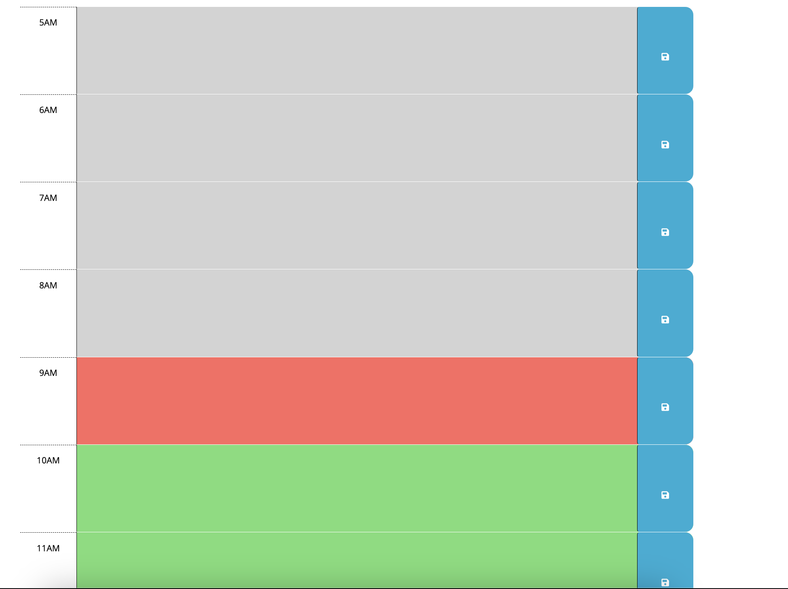

# Work Day Scheduler

## A simple calendar application that allows a user to save events for each hour of the day
---

I wanted to build a simple web application that would allow users to schedule their work day efficiently using the browser to store their hourly plans/tasks for the current work day. Given that this will only be a daily planner, I wanted to make sure that it met certain criteria to ensure it was still an effective way to schedule a user's work day. 

This consists of:

    1. When the planner is opened, the current date and time is displayed at the top
    2. There are time blocks that allow a user to enter in details of a task or reminder for that specific time slot
    3. There must be a button to save the details users have entered
    4. The save button must save the details for the given time slot locally
    5. The site will then grab the locally stored time values and put them in their respective time slots
    6. The time blocks will be color coated to help the user keep track of what on their planner is a past event/task, what currently needs to be done, and what event/task is coming up later on in the day

I learned a lot with this particular project, including a deeper understanding of working with the "this" keyword, working with jquery functions, and using dayjs for date and time manipulation
## Installation
---

N/A

## Usage
---
 Following the link to get to the web application: https://corradoj02.github.io/Work-Day-Scheduler/

 The user will be greeted by a planner with the current date at the top:

They will then be able to see the time blocks that will indicate the current hour of their work day:

These time blocks will have the ability to take in user input data and the floppy disk save icon will be a clickable button that saves their data to local storage to persist:

## Credits
---

N/A

## License
---

N/A

---
